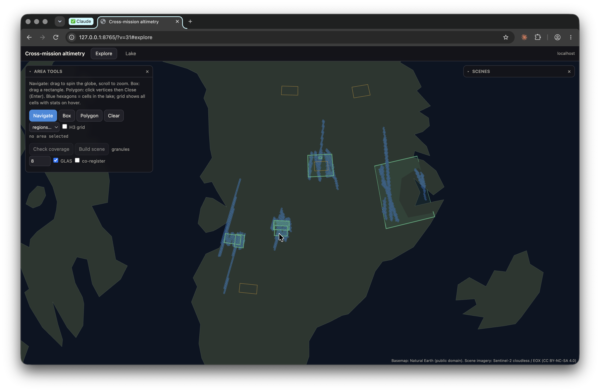
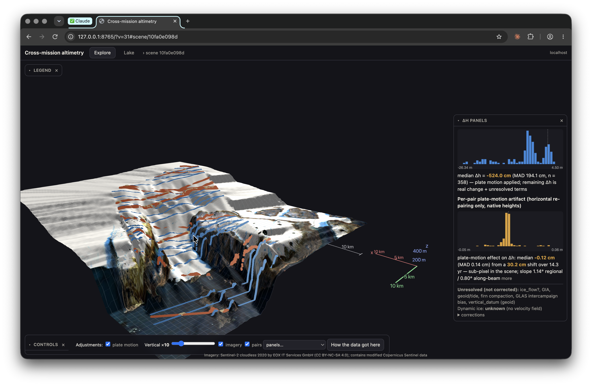
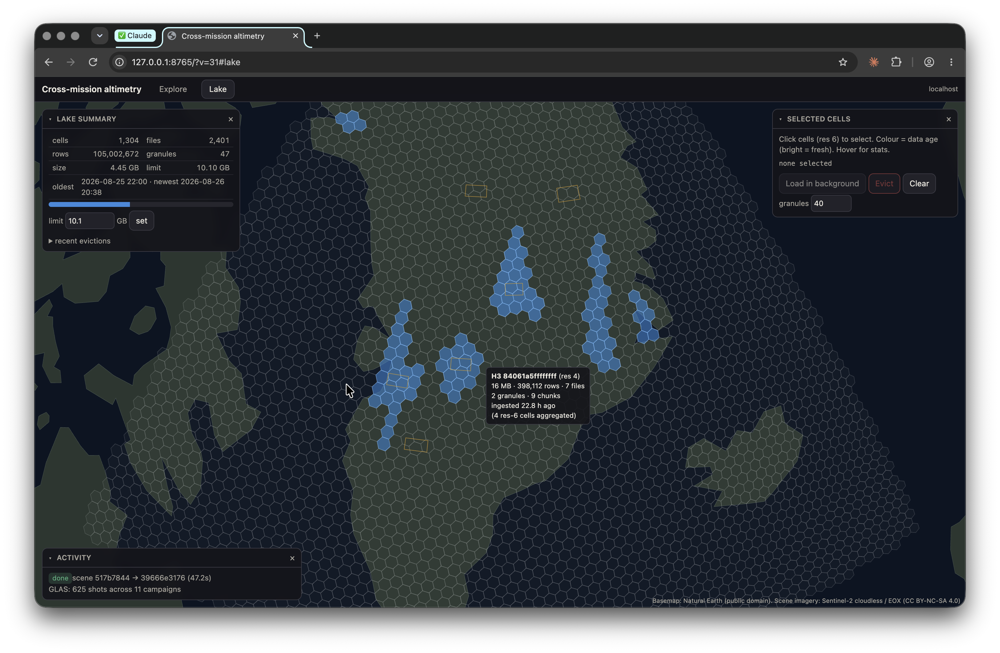

# aicesat — cross-mission altimetry

<table>
<tr>
<td width="33%" valign="top"><br><sub><b>Explore</b> — a 3-D globe: navigate anywhere, draw a box or polygon, check coverage, and build a scene.</sub></td>
<td width="33%" valign="top"><br><sub><b>Scene</b> — ICESat-2 (blue) and GLAS (orange) draped on ArcticDEM; toggle plate motion and read the Δh panels.</sub></td>
<td width="33%" valign="top"><br><sub><b>Lake</b> — the persistent Parquet lake as an H3 grid: per-cell stats, a storage limit, and background loading.</sub></td>
</tr>
</table>

An MCP server for Claude Desktop that pulls real ICESat-2 **ATL03** photons and ICESat/GLAS **GLAH06** shots over a
chosen area, renders them as a 3D point cloud (deck.gl), and — on a toggle — applies an ITRF2014 + epoch
co-registration (plate motion, ITRF2014-PMM / NOAM) with pyproj, updating the co-located Δh statistics. Started from
`cross-mission-altimetry-mcp-spec.md`, which carries the full design and rationale.

The co-registration removes **plate motion** between epochs. It does **not** remove ice flow, GIA, geoid/tide, firn
compaction, or the vertical datum, and the widget says so on every answer. GLAS heights are converted
TOPEX/Poseidon → WGS84 ellipsoid using the product's `d_deltaEllip`, with the saturation correction `d_satElevCorr`
applied; that is recorded in every comparability block.

## Setup

```bash
uv sync          # Python 3.13
uv run pytest    # offline unit tests
```

Earthdata Login: a bearer token is read from `~/.edl/token.prod` (override with `AICESAT_EDL_FILE`, or set
`EARTHDATA_TOKEN`). The server never writes to stdout (stdio MCP transport); logs go to stderr.

## Claude Desktop

Add to `~/Library/Application Support/Claude/claude_desktop_config.json`, using the absolute path to your checkout:

```json
{
  "mcpServers": {
    "aicesat": {
      "command": "/opt/homebrew/bin/uv",
      "args": ["--directory", "/ABSOLUTE/PATH/TO/aicesat", "run", "aicesat-server"]
    }
  }
}
```

Restart Claude Desktop. The unified UI renders inline as an MCP App; the server also serves it at
`http://127.0.0.1:8765/` (port via `AICESAT_PORT`) for use in a browser.

Tools: `open_ui`, `list_regions`, `list_scenes`, `check_coverage`, `show_photons` (region, bbox, or polygon),
`add_glas`, `coregister`, `lake_status`, `lake_load_cells`, `job_status`.

## UI

One self-contained page (built from `src/aicesat/ui/*` + vendored deck.gl / h3-js by `scripts/build_ui.py`, pure
Python; the server rebuilds it on start when sources change), served both inline in Claude Desktop and at `/`:

- **Explore** — a 3-D globe (Natural Earth basemap, no flat projection). Navigate anywhere, draw a box or polygon,
  check coverage, and build a scene as a background job; scene footprints and the loaded H3 cells are shown on the globe.
- **Lake** — the persistent Parquet lake as an H3 grid: per-cell stats on hover, a storage limit that auto-evicts the
  least-recently-used cells, and background loading or eviction of selected cells.
- **Scene** — the 3-D viewer: ICESat-2 and GLAS points draped on a DEM, an **Adjustments** panel of correction toggles,
  and the co-located Δh histograms. The true plate-motion shift is sub-pixel at scene scale, so the clouds do not
  visibly move — the effect is read from the Δh panel, not an exaggerated visual. Panels collapse and close.

The UI talks to a transport-neutral API (`api.py`) exposed two ways: the localhost `/api/*` routes for the browser,
and `visibility:["app"]` MCP tools the host proxies for the inline app. `scripts/e2e_apps.py` checks the MCP-App wiring.

## Architecture

The ATL03 path does not open HDF5 at query time. Per granule, an index build (`index.py`) records each chunk's byte
range, filter pipeline, and the H3 cells it touches. Queries resolve a bbox/polygon to cells, fetch only the needed
chunks by HTTPS range request (EDL bearer token → presigned URL), decode them without an HDF5 library, and materialize
photons into a hive-partitioned Parquet lake (`lake.py`) with per-row provenance and co-registered coordinates. DuckDB
answers over the lake (`api.py`); a coverage table records what is materialized so repeat queries fetch nothing. The
earlier `earthaccess.open + h5py` path is kept as `atl03.extract_legacy` for comparison. `scripts/bench_access.py`
compares the access methods; see the spec (Appendix C) for the approach.

Scene geometry is latitude-aware (`scene.frame_crs`): polar-stereographic near the poles, a per-scene
azimuthal-equidistant projection elsewhere, so scenes render anywhere on Earth.

## DEM and imagery

The scene surface is **ArcticDEM v4.1** (PGC, public COGs, WGS84-ellipsoid heights — the same vertical reference as
ATL03), read by window over `/vsicurl/` and cached; outside its coverage the surface falls back to a height field
interpolated from the photons (labelled as such). Scene imagery is **Sentinel-2 cloudless** (EOX, CC BY-NC-SA 4.0),
mosaicked into the scene frame and draped on the surface. The Explore/Lake globe basemap is Natural Earth (public
domain). Attributions appear on screen.

## Scripts

```bash
uv run scripts/check_coverage.py --region egig_west_flank   # granule counts by month / laser campaign
uv run scripts/ingest.py egig_west_flank                    # index + byte-range ingest + lake query
uv run scripts/build_index.py --region egig_west_flank      # offline index pre-build (amortized off the query path)
uv run scripts/make_scene.py egig_west_flank --glas --coreg # full pipeline for a region
uv run scripts/serve.py                                     # widget server only, for local testing
uv run scripts/bench_access.py                              # access-method comparison
```

Data (`data/`) is gitignored; delete it to force a re-fetch.

## How Δh is measured

For each GLAS shot, the ICESat-2 surface height at the footprint centre comes from a local along-track linear fit of
the signal photons within the co-location radius. A disc median is an order statistic and cannot resolve the sub-cm
slope effect; the fit is continuous in position, so it can. Only the along-beam component of the plate-motion shift is
observable on a single beam, and the per-pair artifact panel keeps the mm-level vertical part of the frame step
separate from the slope effect. Every answer carries the `unresolved` list and states "plate motion applied", never
"the missions agree".
